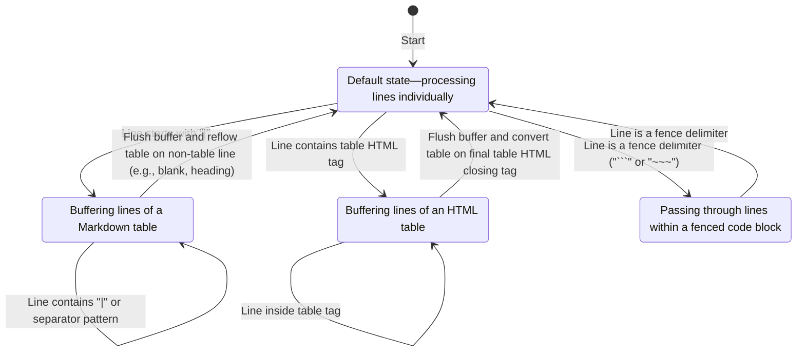
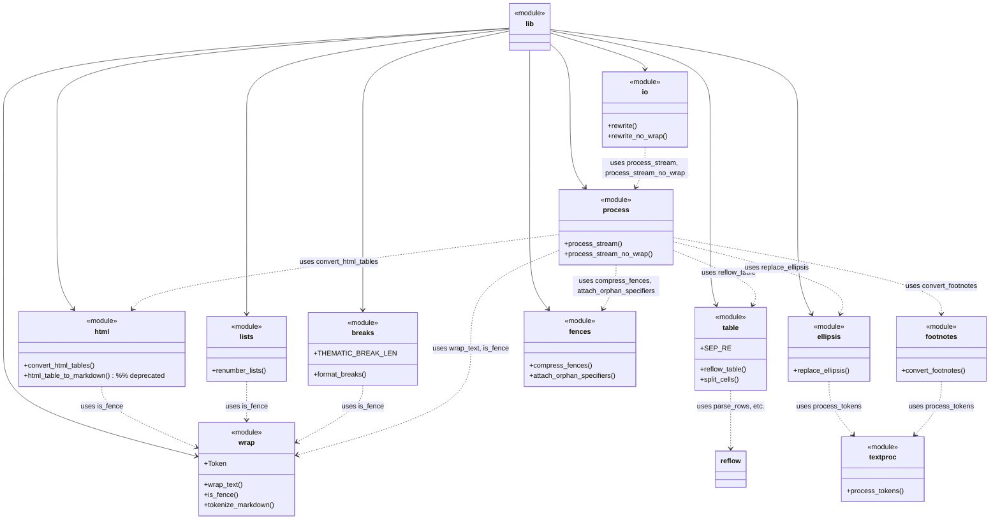
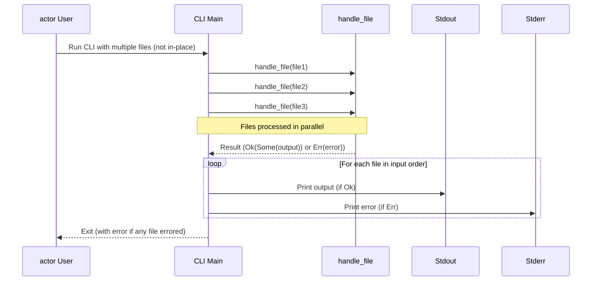

# Architecture

## Contents

- [Markdown stream processor](#markdown-stream-processor)
- [Footnote conversion](#footnote-conversion)
- [HTML table support](#html-table-support-in-mdtablefix)
- [Module relationships](#module-relationships)
- [Concurrency with `rayon`](#concurrency-with-rayon)
- [Unicode width handling](#unicode-width-handling)

## Markdown stream processor

`process_stream_inner` orchestrates line-by-line rewriting. The full
implementation lives in [src/process.rs](../src/process.rs). Its signature is:

```rust
pub fn process_stream_inner(lines: &[String], opts: Options) -> Vec<String>
```

The function combines several helpers documented in `docs/`:

- `fences::compress_fences` and `attach_orphan_specifiers` normalize code block
  delimiters. The latter keeps indentation from the language line when the
  fence lacks it. Language specifiers explicitly set to `null`
  (case-insensitive) or consisting solely of whitespace are treated as absent.
  `compress_fences` also tolerates spaces within comma-separated specifiers,
  e.g. `TOML, Ini` becomes `toml,ini`.
- `html::convert_html_tables` transforms basic HTML tables into Markdown so \
    they can be reflowed like regular tables. See \
    [HTML table support](#html-table-support-in-mdtablefix).
- `wrap::wrap_text` applies optional line wrapping. It relies on the
  `unicode-width` crate for accurate character widths.
- `wrap::tokenize_markdown` emits `Token` values for custom processing.

The function maintains a small state machine that tracks whether it is inside a
Markdown table, an HTML table, or a fenced code block. The state determines how
incoming lines are buffered or emitted. Once the end of a table or fence is
reached, buffered lines are flushed and possibly reformatted. The simplified
behaviour is illustrated below.



Before:

```markdown
|A|B|
|---|---|
|1|22|
<table><tr><td>3</td><td>4</td></tr></table>
```

After:

```markdown
| A | B  |
| --- | --- |
| 1 | 22 |
| 3 | 4  |
```

Code fences are passed through verbatim:

```rust
| not | a | table |
```

After scanning all lines, the processor performs optional post-processing steps
such as ellipsis replacement and footnote conversion. See \
[footnote conversion](#footnote-conversion) for details. The function then
returns the updated stream for writing to disk or further manipulation.

## Footnote Conversion

`mdtablefix` can optionally convert bare numeric references into
GitHub-flavoured Markdown footnotes. A bare numeric reference is a number that
appears after punctuation or before a colon with no footnote formatting, for
example:

```markdown
An example of a bare numeric reference.1
The official docs page showcases several types 7:
```

`convert_footnotes` performs this operation and is exposed via the higher-level
`process_stream_opts` helper. Set
`Options { footnotes: true, ..Default::default() }` when calling
`process_stream_opts` to enable the conversion logic. The parameter defaults to
`false`.

Inline references that appear after punctuation or before a colon are rewritten
as footnote links.

Before:

```markdown
A useful tip.1
Core types 7:
```

After:

```markdown
A useful tip.[^1]
Core types[^7]:
```

Numbers inside inline code or parentheses are ignored.

Before:

```markdown
Look at `code 1` for details.
Refer to equation (1) for context.
```

After:

```markdown
Look at `code 1` for details.
Refer to equation (1) for context.
```

When the final lines of a document form a numbered list, they are replaced with
footnote definitions.

Before:

```markdown
Text.

 1. First note
 2. Second note
```

After:

```markdown
Text.

[^1]: First note
[^2]: Second note
```

`convert_footnotes` only processes the final contiguous list of numeric
references.

## HTML Table Support in `mdtablefix`

`mdtablefix` can format simple HTML `<table>` elements embedded in Markdown.
These HTML tables are transformed into Markdown before the main table reflow
logic runs. That preprocessing is handled by the `convert_html_tables` function.

Only straightforward tables with `<tr>`, `<th>` and `<td>` tags are detected.
Attributes and tag casing are ignored, and complex nested or styled tables are
not supported. After conversion, each HTML table is represented as a Markdown
table, so the usual reflow algorithm can align its columns consistently with
the rest of the document.

```html
<table>
  <tr><th>A</th><th>B</th></tr>
  <tr><td>1</td><td>2</td></tr>
</table>
```

The converter checks the first table row for `<th>` cells or for `<strong>` or
`<b>` tags inside `<td>` elements to decide whether it is a header. If no such
markers exist and the table contains multiple rows, the first row is still
treated as the header, so the Markdown output includes a separator line. This
last-resort behaviour keeps simple tables readable after conversion.

## Module Relationships

This diagram illustrates the connections between the crate's modules.



The `lib` module is re-exported as the public API from the other modules. The
`wrap` module exposes the `Token` enum and `tokenize_markdown` function for
custom processing. The `ellipsis` module performs text normalization, while
`footnotes` converts bare references. The `textproc` module contains shared
token-processing helpers used by both the `ellipsis` and `footnotes` modules.
Tokenization is handled by `wrap::tokenize_markdown`, replacing the small state
machine that previously resided in `process_tokens`. The `process` module
provides streaming helpers that combine the lower-level functions. The `io`
module handles filesystem operations, delegating the text processing to
`process`.

The helper `html_table_to_markdown` is retained for backward compatibility but
is deprecated. New code should call `convert_html_tables` instead.

## Concurrency with `rayon`

`mdtablefix` uses the `rayon` crate to process multiple files concurrently.
`rayon` provides a work-stealing thread pool and simple parallel iterators. The
tool relies on Rayon's global thread pool so that no manual setup is required.
The dependency is specified as `1.0` in `Cargo.toml` to track stable API
changes within the same major release.

Parallelism is enabled automatically whenever more than one file path is
provided on the command line. Each worker gathers its output before printing,
so results appear in the original order. This buffering increases memory usage
and may reduce performance if many tiny files are processed.



## Unicode Width Handling

`mdtablefix` wraps paragraphs and list items while respecting the display width
of Unicode characters. The `unicode-width` crate is used to compute the width
of strings when deciding where to break lines. This prevents emojis or other
multibyte characters from causing unexpected wraps or truncation.

Whenever wrapping logic examines the length of a token, it relies on
`UnicodeWidthStr::width` to measure visible columns rather than byte length.

## Link punctuation handling

Trailing punctuation immediately following a Markdown link or image is
tokenized separately and grouped with the link when wrapping. This keeps
sentences like:

```markdown
[link](path).
```

on a single line, rather than splitting the punctuation onto the next line when
wrapping occurs.

## Inline code punctuation handling

Trailing punctuation that follows an inline code span is grouped with the code
when wrapping. This prevents sentences such as:

```markdown
`useState`.
```

from splitting the full stop onto a new line, preserving the code span's
readability.
