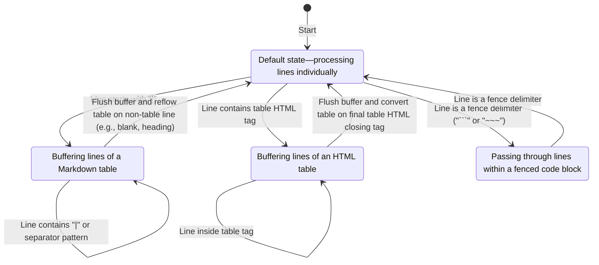
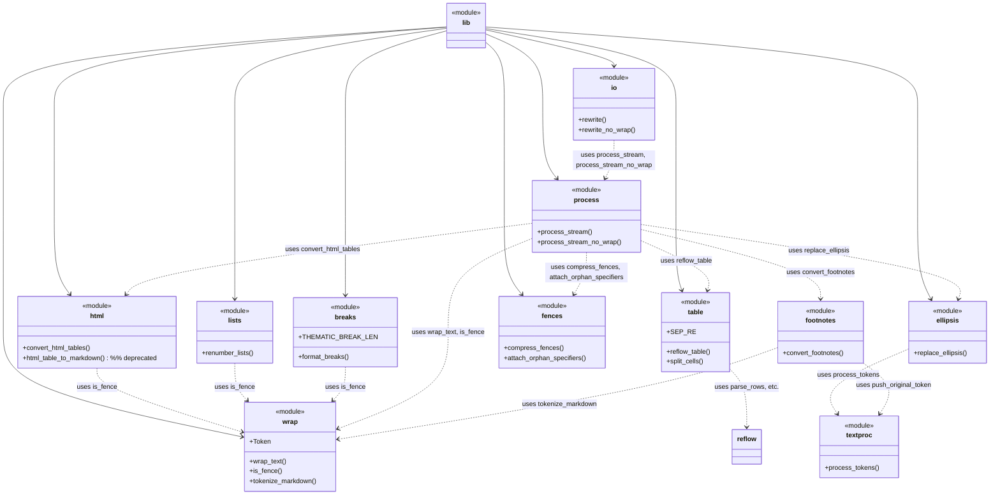
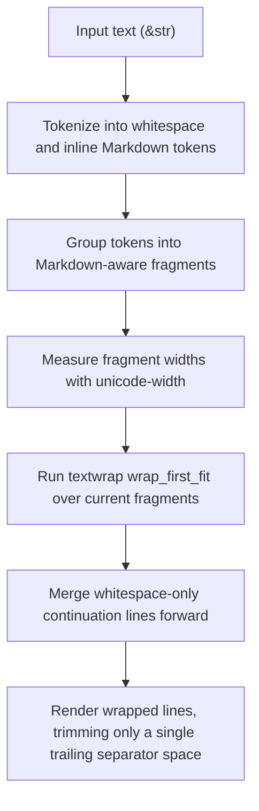
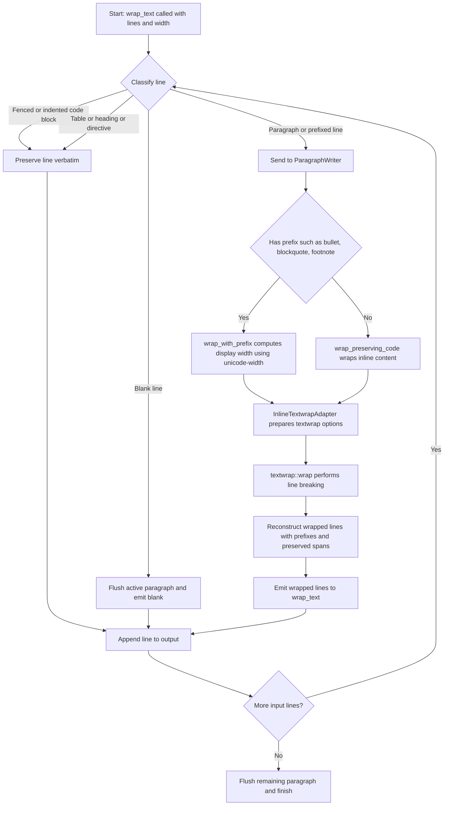
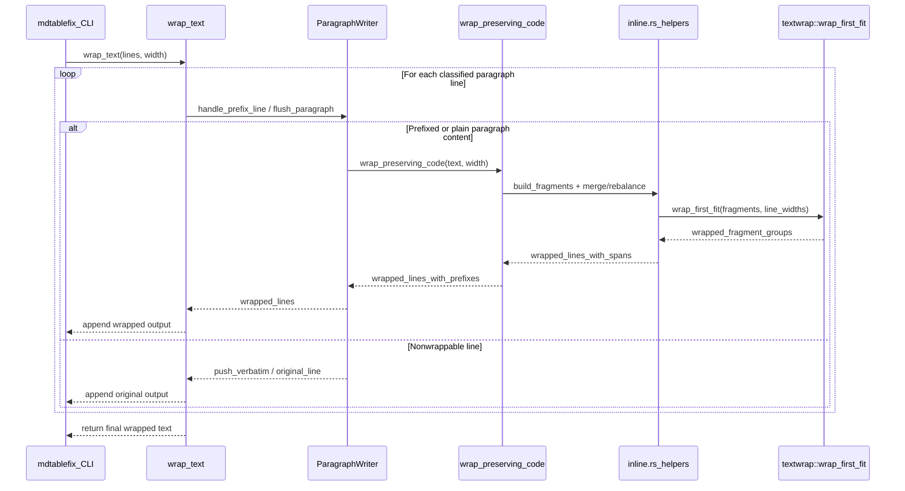
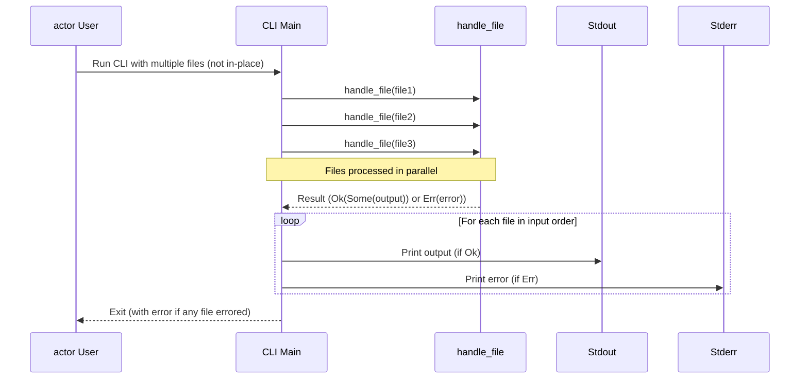

# Architecture

## Contents

- [Markdown stream processor](#markdown-stream-processor)
- [Table reflow pipeline](#table-reflow-pipeline)
- [Footnote conversion](#footnote-conversion)
- [HTML table support](#html-table-support-in-mdtablefix)
- [Module relationships](#module-relationships)
- [Concurrency with `rayon`](#concurrency-with-rayon)
- [Unicode width handling](#unicode-width-handling)

## Markdown stream processor

`process_stream_inner` orchestrates line-by-line rewriting. The full
implementation lives in [src/process.rs](../src/process.rs). Its signature is:

```rust
pub fn process_stream_inner(lines: &[String], opts: Options) -> Vec<String>
```

The function combines several helpers documented in `docs/`:

- `frontmatter::split_leading_yaml_frontmatter` detects and splits a leading
  YAML frontmatter block from the document body. A valid frontmatter block
  starts with `---` on the first line and ends with `---` or `...` before any
  body content. The prefix is preserved verbatim while only the body is
  processed. This shielding also applies to CLI-only transforms such as
  `renumber_lists` and `format_breaks`.
- `fences::compress_fences` and `attach_orphan_specifiers` normalize code block
  delimiters. The latter keeps indentation from the language line when the
  fence lacks it. Language specifiers explicitly set to `null`
  (case-insensitive) or consisting solely of whitespace are treated as absent.
  `compress_fences` also tolerates spaces within comma-separated specifiers,
  e.g. `TOML, Ini` becomes `toml,ini`.
- `html::convert_html_tables` transforms basic HTML tables into Markdown so \
  they can be reflowed like regular tables. See \
  [HTML table support](#html-table-support-in-mdtablefix).
- `wrap::wrap_text` applies optional line wrapping. It classifies Markdown
  block structure locally and delegates greedy line fitting to the `textwrap`
  crate over Markdown-aware fragments measured with `unicode-width`.
- `wrap::tokenize_markdown` emits `Token` values for custom processing.
- `headings::convert_setext_headings` rewrites Setext headings with underline
  markers into ATX headings when the CLI `--headings` flag is provided. The
  underline must contain at least three identical `=` or `-` characters, so the
  converter can distinguish headings from thematic breaks or list markers. The
  helper only rewrites lines whose shared prefix is whitespace or `>` so nested
  lists continue to behave normally.

Heading conversion runs after fence/table processing and before wrapping, so
the wrapping stage observes ATX headings and leaves them untouched.

The function maintains a small state machine that tracks whether it is inside a
Markdown table, an HTML table, or a fenced code block. The state determines how
incoming lines are buffered or emitted. Once the end of a table or fence is
reached, buffered lines are flushed and possibly reformatted. The simplified
behaviour is illustrated below.


```mermaid
stateDiagram-v2

    [*] --> Streaming: Start

    Streaming: Default state—processing lines individually

    InMarkdownTable: Buffering lines of a Markdown table

    InHtmlTable: Buffering lines of an HTML table

    InCodeFence: Passing through lines within a fenced code block

    Streaming --> InMarkdownTable: Line starts with "|"
    Streaming --> InHtmlTable: Line contains table HTML tag
    Streaming --> InCodeFence: Line is a fence delimiter ("```" or "~~~")

    InMarkdownTable --> Streaming: Flush buffer and reflow table on non-table line (e.g., blank, heading)
    InMarkdownTable --> InMarkdownTable: Line contains "|" or separator pattern

    InHtmlTable --> Streaming: Flush buffer and convert table on final table HTML closing tag
    InHtmlTable --> InHtmlTable: Line inside table tag

    InCodeFence --> Streaming: Line is a fence delimiter
```

Before:

```markdown
|A|B|
|---|---|
|1|22|
<table><tr><td>3</td><td>4</td></tr></table>
```

After:

```markdown
| A | B  |
| --- | --- |
| 1 | 22 |
| 3 | 4  |
```

Code fences are passed through verbatim:

```rust
| not | a | table |
```

After scanning all lines, the processor performs optional post-processing steps
such as ellipsis replacement and footnote conversion. See \
[footnote conversion](#footnote-conversion) for details. The function then
returns the updated stream for writing to disk or further manipulation.

## Table reflow pipeline

`reflow_table` aligns Markdown tables in four stages:

1. `extract_indent_and_trim` records any leading indentation and removes table
   escape lines such as `\-`.
2. `parse_rows` protects continuation rows before the global split. When a row
   starts with empty cells, `protect_leading_empty_cells` replaces those cells
   with a private marker so they survive the sentinel-based row splitter.
3. `clean_rows`, `detect_separator`, and `calculate_widths` rebuild the logical
   table. Explicit separator lines are preferred, but the second parsed row can
   be promoted when the source embeds the separator in the body. Widths are
   measured with `UnicodeWidthStr::width`, so Chinese, Japanese, and Korean
   (CJK) text, emoji, and accented characters align by display width rather
   than byte count.
4. `format_rows` and `insert_separator` emit the final table. Separator cells
   preserve alignment markers, and each separator column is widened to at least
   three dashes to keep Markdown linters satisfied.

Continuation-row protection has one extra constraint: once the protected row is
rebuilt, literal pipe characters inside the non-leading cells are re-escaped as
`\|`. Without that step, a second parse would treat the restored pipe as a new
column delimiter and split the row incorrectly.

When `process_stream_inner` flushes a buffered table with `Options::ellipsis`
enabled, it applies ellipsis replacement before calling `reflow_table`. This
ordering ensures the width calculation sees the final glyphs, rather than
aligning for `...` and shrinking the rendered column after the fact.

The rationale for these choices is captured in
[Architecture Decision Record (ADR) 0001](adrs/0001-table-reflow-pipeline.md).

## Footnote Conversion

`mdtablefix` can optionally convert bare numeric references into
GitHub-flavoured Markdown footnotes. A bare numeric reference is a number that
appears after punctuation or before a colon with no footnote formatting, for
example:

```markdown
An example of a bare numeric reference.1
The official docs page showcases several types 7:
```

`convert_footnotes` performs this operation and is exposed via the higher-level
`process_stream_opts` helper. Set
`Options { footnotes: true, ..Default::default() }` when calling
`process_stream_opts` to enable the conversion logic. The parameter defaults to
`false`.

Inline references that appear after punctuation or before a colon are rewritten
as footnote links.

Before:

```markdown
A useful tip.1
Core types 7:
```

After:

```markdown
A useful tip.[^1]
Core types[^7]:
```

Numbers inside inline code or parentheses are ignored.

ATX heading lines (including those nested in blockquotes and list items) are
not processed for footnote conversion, so identifiers like "A.2" remain
verbatim. Setext-style headings are not detected unless the `--headings`
conversion already rewrote them into ATX headings earlier in the pipeline.

Before:

```markdown
Look at `code 1` for details.
Refer to equation (1) for context.
```

After:

```markdown
Look at `code 1` for details.
Refer to equation (1) for context.
```

When the final lines of a document form a numbered list that is preceded by an
H2 heading (the heading text is not inspected), and the document contains no
existing footnote definitions outside fenced code blocks, they are replaced
with footnote definitions. Blank lines and indentation within the list are
tolerated; blank-only trailing blocks are ignored. Lines beginning with inline
footnote references at the start of a line do not count as existing
definitions, allowing references before the final footnote definition block.
Definitions prefixed by blockquote markers (`>`) still count as existing
blocks, but those inside fenced code blocks are ignored.

Once inline references and trailing lists are normalised, `renumber_footnotes`
walks the document in the order readers encounter references. It assigns
sequential identifiers starting from one, rewrites every reference to use its
new identifier, and updates footnote definitions to match. Trailing numeric
lists are converted into definitions when the document already contains at
least one footnote reference or definition, ensuring unrelated lists are left
untouched. The rewritten definitions are then sorted numerically so the
rendered footnote block mirrors the logical ordering of references in the text.

Before:

```markdown
Text.

## Footnotes

 1. First note

 2. Second note

10. Final note
```

After:

```markdown
Text.

## Footnotes

 [^1]: First note

 [^2]: Second note

[^10]: Final note
```

`convert_footnotes` only processes the final contiguous numeric list that
immediately follows an H2 heading when these conditions are met.

## HTML Table Support in `mdtablefix`

`mdtablefix` can format simple HTML `<table>` elements embedded in Markdown.
These HTML tables are transformed into Markdown before the main table reflow
logic runs. That preprocessing is handled by the `convert_html_tables` function.

Only straightforward tables with `<tr>`, `<th>` and `<td>` tags are detected.
Attributes and tag casing are ignored, and complex nested or styled tables are
not supported. After conversion, each HTML table is represented as a Markdown
table, so the usual reflow algorithm can align its columns consistently with
the rest of the document.

```html
<table>
  <tr><th>A</th><th>B</th></tr>
  <tr><td>1</td><td>2</td></tr>
</table>
```

The converter checks the first table row for `<th>` cells or for `<strong>` or
`<b>` tags inside `<td>` elements to decide whether it is a header. If no such
markers exist and the table contains multiple rows, the first row is still
treated as the header, so the Markdown output includes a separator line. This
last-resort behaviour keeps simple tables readable after conversion.

## Module Relationships

This diagram illustrates the connections between the crate's modules.


```mermaid
classDiagram
    class lib {
        <<module>>
    }
    class html {
        <<module>>
        +convert_html_tables()
        +html_table_to_markdown() %% deprecated
    }
    class table {
        <<module>>
        +reflow_table()
        +split_cells()
        +SEP_RE
    }
    class wrap {
        <<module>>
        +wrap_text()
        +is_fence()
        +Token
        +tokenize_markdown()
    }
    class lists {
        <<module>>
        +renumber_lists()
    }
    class breaks {
        <<module>>
        +format_breaks()
        +THEMATIC_BREAK_LEN
    }
    class ellipsis {
        <<module>>
        +replace_ellipsis()
    }
    class fences {
        <<module>>
        +compress_fences()
        +attach_orphan_specifiers()
    }
    class footnotes {
        <<module>>
        +convert_footnotes()
    }
    class textproc {
        <<module>>
        +process_tokens()
    }
    class process {
        <<module>>
        +process_stream()
        +process_stream_no_wrap()
    }
    class io {
        <<module>>
        +rewrite()
        +rewrite_no_wrap()
    }
    lib --> html
    lib --> table
    lib --> wrap
    lib --> lists
    lib --> breaks
    lib --> ellipsis
    lib --> fences
    lib --> process
    lib --> io
    html ..> wrap : uses is_fence
    table ..> reflow : uses parse_rows, etc.
    lists ..> wrap : uses is_fence
    breaks ..> wrap : uses is_fence
    ellipsis ..> textproc : uses process_tokens
    process ..> html : uses convert_html_tables
    process ..> table : uses reflow_table
    process ..> wrap : uses wrap_text, is_fence
    process ..> fences : uses compress_fences, attach_orphan_specifiers
    process ..> ellipsis : uses replace_ellipsis
    process ..> footnotes : uses convert_footnotes
    footnotes ..> wrap : uses tokenize_markdown
    footnotes ..> textproc : uses push_original_token
    io ..> process : uses process_stream, process_stream_no_wrap
```

The `lib` module is re-exported as the public API from the other modules. The
`wrap` module exposes the `Token` enum and `tokenize_markdown` function for
custom processing. The `ellipsis` module performs text normalization, while
`footnotes` converts bare references. The `textproc` module contains shared
token-processing helpers used by both the `ellipsis` and `footnotes` modules.
Tokenization is handled by `wrap::tokenize_markdown`, replacing the small state
machine that previously resided in `process_tokens`. The `process` module
provides streaming helpers that combine the lower-level functions. The `io`
module handles filesystem operations, delegating the text processing to
`process`.

### Tokenizer flow

The inline tokenizer still iterates over the source string lazily, so no
duplicate `Vec<char>` representation is required. The resulting tokens are then
grouped into Markdown-aware fragments and passed to
`textwrap::wrap_algorithms::wrap_first_fit`, which chooses the breakpoints
without splitting code spans, links, or punctuation groups.


```mermaid
flowchart TD
    A["Input text (&str)"] --> B["Tokenize into whitespace and inline Markdown tokens"]
    B --> C["Group tokens into Markdown-aware fragments"]
    C --> D["Measure fragment widths with unicode-width"]
    D --> E["Run textwrap wrap_first_fit over current fragments"]
    E --> F["Merge whitespace-only continuation lines forward"]
    F --> G["Render wrapped lines, trimming only a single trailing separator space"]
```

Figure: Wrap-tokenizer flow. Starting from an input string, the wrapper emits
whitespace and inline Markdown tokens, groups them into fragments, measures
their display widths with `unicode-width`, feeds them through
`textwrap::wrap_algorithms::wrap_first_fit`, and then reconstructs wrapped
lines while preserving Markdown-aware spacing rules.

### Wrap flow

The higher-level `wrap_text` entry point combines block classification,
paragraph buffering, prefix-aware wrapping, and inline line fitting. The
following flow shows how a line moves through those stages before it is either
preserved verbatim or emitted as wrapped output.


```mermaid
flowchart TD
    A[Start: wrap_text called with lines and width] --> B{Classify line}

    B -->|Fenced or indented code block| C[Preserve line verbatim]
    B -->|Table or heading or directive| C
    B -->|Blank line| D[Flush active paragraph and emit blank]
    B -->|Paragraph or prefixed line| E[Send to ParagraphWriter]

    E --> F{Has prefix such as bullet, blockquote, footnote}
    F -->|Yes| G[wrap_with_prefix computes display width using unicode-width]
    F -->|No| H[wrap_preserving_code wraps inline content]

    G --> I[InlineTextwrapAdapter prepares textwrap options]
    H --> I

    I --> J[textwrap::wrap performs line breaking]
    J --> K[Reconstruct wrapped lines with prefixes and preserved spans]
    K --> L[Emit wrapped lines to wrap_text]

    C --> M[Append line to output]
    D --> M
    L --> M

    M --> N{More input lines?}
    N -->|Yes| B
    N -->|No| O[Flush remaining paragraph and finish]
```

Figure: `wrap_text` control flow. The wrapper classifies each incoming line,
passes fenced blocks, tables, headings, directives, and indented code through
unchanged, flushes paragraphs on blanks, routes prose and prefixed lines
through `ParagraphWriter`, computes visible widths with `unicode-width`, and
delegates inline line fitting to `textwrap` before reconstructing the emitted
Markdown lines.

### Wrap sequence

The following sequence diagram focuses on the runtime collaboration between the
CLI entry point, `wrap_text`, `ParagraphWriter`, the inline wrapper, and
`textwrap` while a paragraph is being processed.


```mermaid
sequenceDiagram
    participant CLI as mdtablefix_CLI
    participant WT as wrap_text
    participant PW as ParagraphWriter
    participant WP as wrap_preserving_code
    participant IH as inline.rs_helpers
    participant TW as textwrap::wrap_first_fit

    CLI->>WT: wrap_text(lines, width)
    loop For each classified paragraph line
        WT->>PW: handle_prefix_line / flush_paragraph
        alt Prefixed or plain paragraph content
            PW->>WP: wrap_preserving_code(text, width)
            WP->>IH: build_fragments + merge/rebalance
            IH->>TW: wrap_first_fit(fragments, line_widths)
            TW-->>IH: wrapped_fragment_groups
            IH-->>WP: wrapped_lines_with_spans
            WP-->>PW: wrapped_lines_with_prefixes
            PW-->>WT: wrapped_lines
            WT-->>CLI: append wrapped output
        else Nonwrappable line
            PW-->>WT: push_verbatim / original_line
            WT-->>CLI: append original output
        end
    end
    WT-->>CLI: return final wrapped text
```

Figure: `wrap_text` sequence flow. The CLI calls `wrap_text`, which delegates
paragraph handling to `ParagraphWriter`; wrappable paragraph content then flows
through `wrap_preserving_code`, the fragment-building and post-processing
helpers in `src/wrap/inline.rs`, and the underlying `textwrap` engine before
wrapped lines return through the same stack to the CLI, while nonwrappable
lines bypass the inline wrapping path and are emitted unchanged.

The helper `html_table_to_markdown` is retained for backward compatibility but
is deprecated. New code should call `convert_html_tables` instead.

## Concurrency with `rayon`

`mdtablefix` uses the `rayon` crate to process multiple files concurrently.
`rayon` provides a work-stealing thread pool and simple parallel iterators. The
tool relies on Rayon's global thread pool so that no manual setup is required.
The dependency is specified as `1.0` in `Cargo.toml` to track stable API
changes within the same major release.

Parallelism is enabled automatically whenever more than one file path is
provided on the command line. Each worker gathers its output before printing,
so results appear in the original order. This buffering increases memory usage
and may reduce performance if many tiny files are processed.


```mermaid
sequenceDiagram
    participant User as actor User
    participant CLI as CLI Main
    participant FileHandler as handle_file
    participant Stdout as Stdout
    participant Stderr as Stderr

    User->>CLI: Run CLI with multiple files (not in-place)
    CLI->>FileHandler: handle_file(file1)
    CLI->>FileHandler: handle_file(file2)
    CLI->>FileHandler: handle_file(file3)
    Note over CLI,FileHandler: Files processed in parallel
    FileHandler-->>CLI: Result (Ok(Some(output)) or Err(error))
    loop For each file in input order
        CLI->>Stdout: Print output (if Ok)
        CLI->>Stderr: Print error (if Err)
    end
    CLI-->>User: Exit (with error if any file errored)
```

## Unicode Width Handling

`mdtablefix` wraps paragraphs and list items while respecting the display width
of Unicode characters. The `unicode-width` crate is used to compute the width
of prefixes and Markdown-aware wrapping fragments before `textwrap` performs
line fitting. This prevents emojis or other multibyte characters from causing
unexpected wraps or truncation.

Whenever wrapping logic examines the length of a token, it relies on
`UnicodeWidthStr::width` to measure visible columns rather than byte length.

## Link punctuation handling

Trailing punctuation immediately following a Markdown link or image is
tokenized separately and grouped with the link when wrapping. This keeps
sentences like:

```markdown
[link](path).
```

on a single line, rather than splitting the punctuation onto the next line when
wrapping occurs.

## Inline code punctuation handling

Trailing punctuation that follows an inline code span is grouped with the code
when wrapping. This prevents sentences such as:

```markdown
`useState`.
```

from splitting the full stop onto a new line, preserving the code span's
readability.

This grouping is deliberately narrow. Whitespace between separate inline code
spans remains a valid break opportunity, so sequences such as `.toml`, `.json`,
`.json5`, `.yaml`, and `.yml` can wrap between spans when required. The
coupling rule only keeps immediately trailing punctuation with the preceding
code span.
