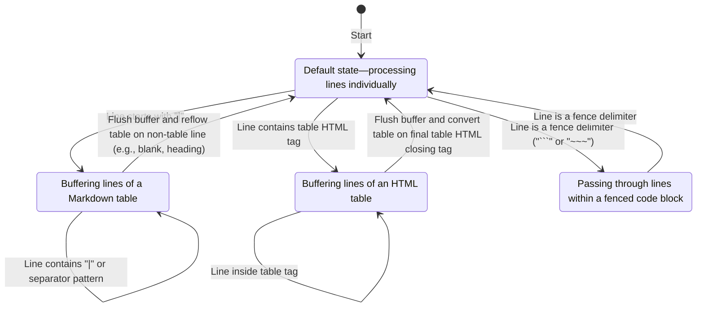
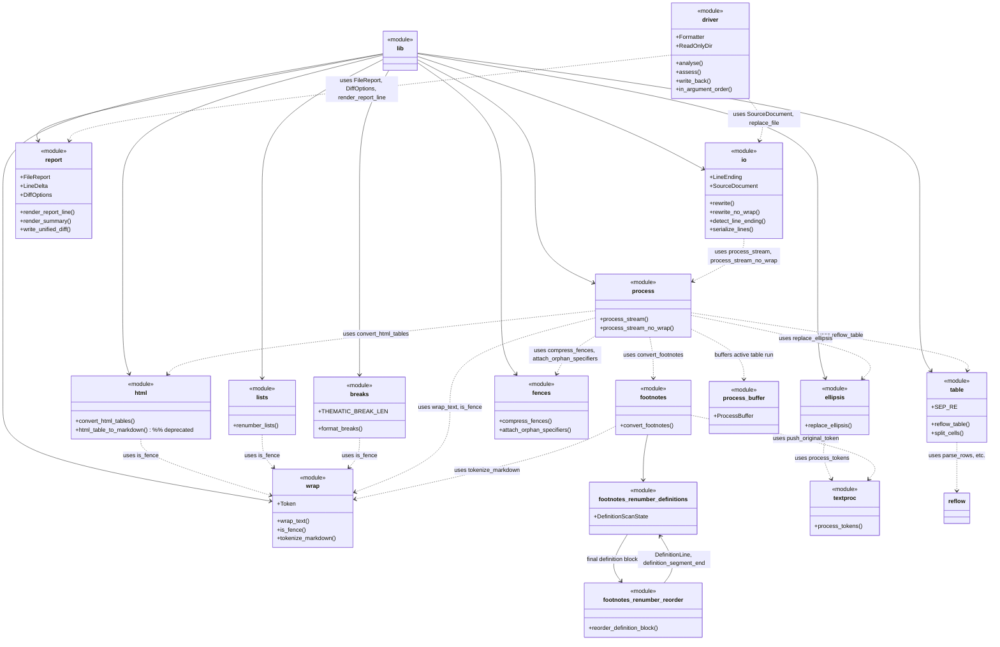
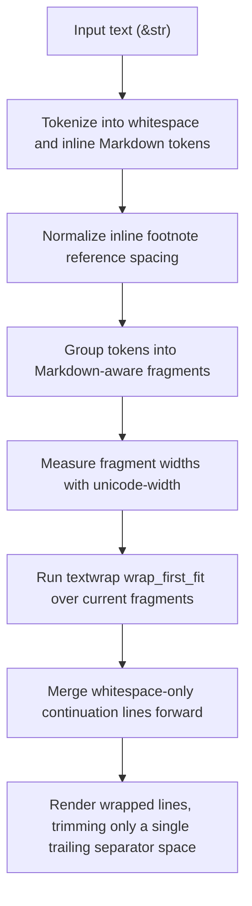
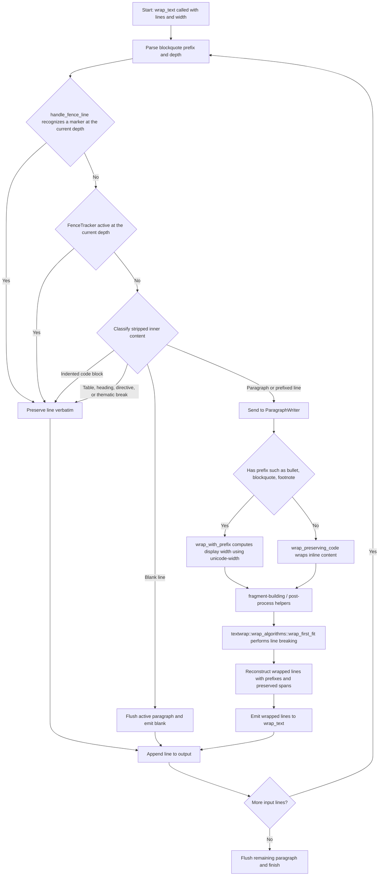
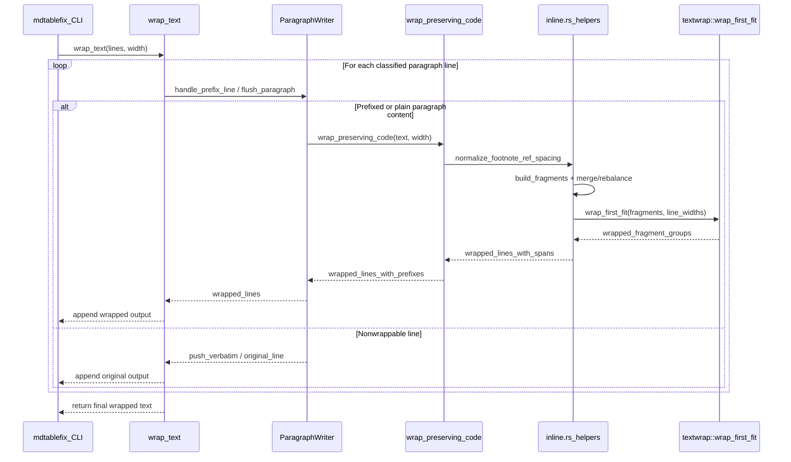
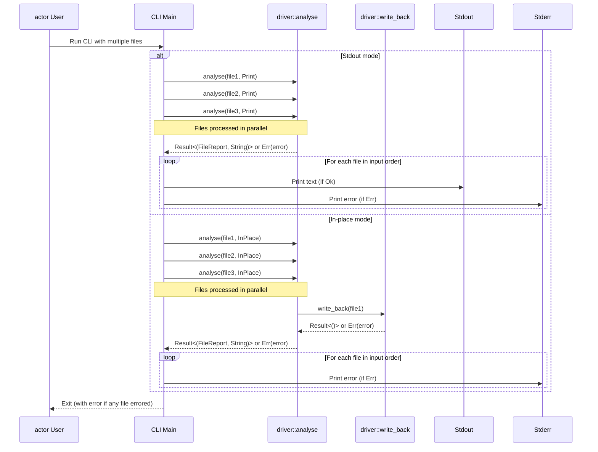
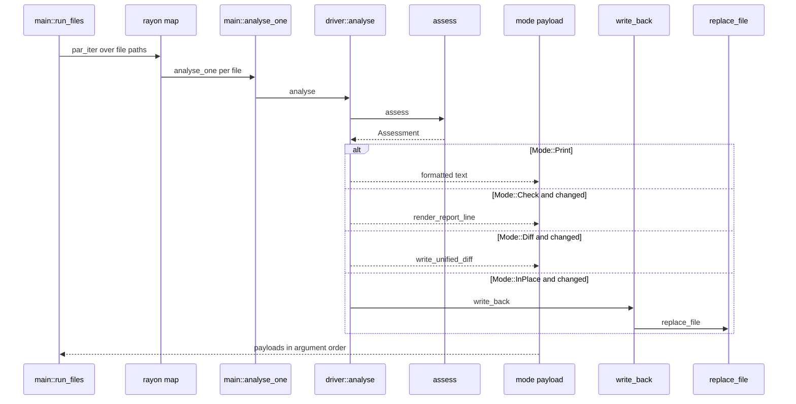
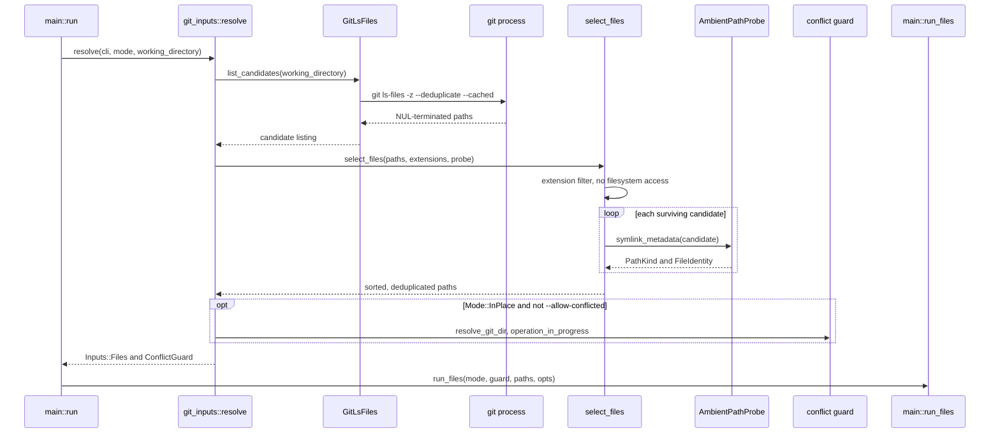
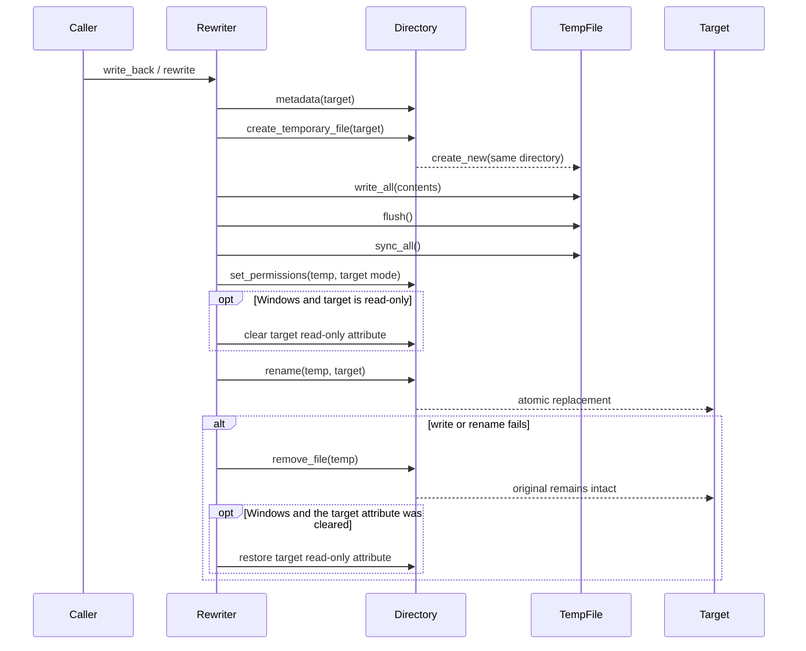

# Architecture

## Contents

- [Markdown stream processor](#markdown-stream-processor)
- [Table reflow pipeline](#table-reflow-pipeline)
- [Footnote conversion](#footnote-conversion)
- [HTML table support](#html-table-support-in-mdtablefix)
- [Module relationships](#module-relationships)
- [Concurrency with `rayon`](#concurrency-with-rayon)
- [Check and diff reporting](#check-and-diff-reporting)
- [Git file selection](#git-file-selection)
- [Atomic in-place writes](#atomic-in-place-writes)
- [Unicode width handling](#unicode-width-handling)
- [Link punctuation handling](#link-punctuation-handling)
- [Inline code punctuation handling](#inline-code-punctuation-handling)

## Markdown stream processor

`process_stream_inner` orchestrates line-by-line rewriting. The full
implementation lives in [src/process.rs](../src/process.rs). Its signature is:

```rust
pub fn process_stream_inner(lines: &[String], opts: Options) -> Vec<String>
```

The public stream entry points call `process_with_frontmatter` before invoking
this function. It is the canonical boundary for leading YAML frontmatter: it
passes only the post-frontmatter body to a caller-provided closure and restores
the prefix verbatim after the closure returns. The library pipeline and
`process_lines` in the binary both use this boundary, with CLI-only transforms
such as `renumber_lists` and `format_breaks` inside the binary's closure.

The function combines several helpers documented in `docs/`:

- `frontmatter::split_leading_yaml_frontmatter` detects a valid leading YAML
  frontmatter block for `process_with_frontmatter`. A block starts with `---`
  on the first line and ends with `---` or `...` before any body content.
- `fences::compress_fences` and `attach_orphan_specifiers` normalize code block
  delimiters. Fence normalization uses the same `FenceTracker` semantics as
  wrapping, so fence-like lines inside an already open fenced block remain
  literal content. Outer delimiters are only compressed when doing so cannot
  make a nested literal fence look structural. `attach_orphan_specifiers`
  preserves and propagates indentation from the language line when the target
  fence lacks indentation. Language specifiers explicitly set to `null`
  (case-insensitive) or consisting solely of whitespace are treated as absent.
  `compress_fences` also tolerates spaces within comma-separated specifiers,
  e.g. `TOML, Ini` becomes `toml,ini`.
- `html::convert_html_tables` transforms basic HTML tables into Markdown so \
  they can be reflowed like regular tables. See \
  [HTML table support](#html-table-support-in-mdtablefix).
- `wrap::wrap_text` applies optional line wrapping. It classifies Markdown
  block structure locally and delegates greedy line fitting to the `textwrap`
  crate over Markdown-aware fragments measured with `unicode-width`.
- `wrap::tokenize_markdown` emits `Token` values for custom processing.
- `headings::convert_setext_headings` rewrites Setext headings with underline
  markers into ATX headings when the CLI `--headings` flag is provided. The
  underline must contain at least three identical `=` or `-` characters, so the
  converter can distinguish headings from thematic breaks or list markers. The
  helper only rewrites lines whose shared prefix is whitespace or `>` so nested
  lists continue to behave normally. A candidate is converted only when it is
  paragraph text: a line that is itself a block start under the wrapper's
  classification — an ATX heading, thematic break, list item, blockquote,
  definition, directive, or fence marker — keeps its underline, so the line
  below it survives as a block of its own. A table delimiter row is refused on
  the same grounds: it is table syntax rather than paragraph text, recognized
  with the table parser's `SEP_RE`, so the break below it is not read as its
  underline. The predicate is measured after the
  shared prefix is removed, so quoted headings still convert. A candidate
  indented by four or more columns is refused as an indented code
  block. The indentation width is measured on the whole line before the shared
  prefix is removed, so the prefix cannot hide the indentation; blockquote
  markers and their optional single space are consumed first, and tabs count
  as four columns.

Heading conversion runs after fence/table processing and before wrapping, so
the wrapping stage observes ATX headings and leaves them untouched.

The function maintains a small state machine that tracks whether it is inside a
Markdown table, an HTML table, or a fenced code block. The state determines how
incoming lines are buffered or emitted. Once the end of a table or fence is
reached, buffered lines are flushed and possibly reformatted. The simplified
behaviour is illustrated below.

State-machine abstraction options for this and the wrapping continuation
machines are evaluated in
[Architecture Decision Record (ADR) 0004](adrs/0004-state-machine-abstractions.md).


```mermaid
stateDiagram-v2

    [*] --> Streaming: Start

    Streaming: Default state—processing lines individually

    InMarkdownTable: Buffering lines of a Markdown table

    InHtmlTable: Buffering lines of an HTML table

    InCodeFence: Passing through lines within a fenced code block

    Streaming --> InMarkdownTable: Line starts with "|"
    Streaming --> InHtmlTable: Line contains table HTML tag
    Streaming --> InCodeFence: Line is a fence delimiter ("```" or "~~~")

    InMarkdownTable --> Streaming: Flush buffer and reflow table on non-table line (e.g., blank, heading)
    InMarkdownTable --> InMarkdownTable: Line contains "|" or separator pattern

    InHtmlTable --> Streaming: Flush buffer and convert table on final table HTML closing tag
    InHtmlTable --> InHtmlTable: Line inside table tag

    InCodeFence --> Streaming: Line is a fence delimiter
```

Before:

```markdown
|A|B|
|---|---|
|1|22|
<table><tr><td>3</td><td>4</td></tr></table>
```

After:

```markdown
| A | B  |
| --- | --- |
| 1 | 22 |
| 3 | 4  |
```

Code fences are passed through verbatim:

```rust
| not | a | table |
```

After scanning all lines, the processor performs its optional post-processing
steps in a fixed order: Setext heading conversion, code-emphasis repair,
ellipsis replacement, paragraph wrapping, and finally footnote conversion.
Ellipsis replacement runs before wrapping, so line breaking is computed from
the glyphs the reader will see. See \
[footnote conversion](#footnote-conversion) for details. The function then
returns the updated stream for writing to disk or further manipulation.

## Table reflow pipeline

`reflow_table` aligns Markdown tables in four stages:

1. `extract_indent_and_trim` records any leading indentation and removes table
   escape lines such as `\-`.
2. `parse_rows` preserves physical source-line boundaries. When a row starts
   with empty cells, `protect_leading_empty_cells` replaces those cells with a
   private marker. The parser uses the inferred table width to recover only
   complete legacy rows concatenated on one line, so row boundaries remain
   structural and cannot collide with cell data.
3. `clean_rows`, `detect_separator`, and `calculate_widths` rebuild the logical
   table. Explicit separator lines are preferred, but the second parsed row can
   be promoted when the source embeds the separator in the body. Widths are
   measured with `UnicodeWidthStr::width`, so Chinese, Japanese, and Korean
   (CJK) text, emoji, and accented characters align by display width rather
   than byte count.
4. `format_rows` and `insert_separator` emit the final table. Separator cells
   preserve alignment markers, and each separator column is widened to at least
   three dashes to keep Markdown linters satisfied.

Continuation-row protection has one extra constraint: once the protected row is
rebuilt, literal pipe characters inside the non-leading cells are re-escaped as
`\|`. Without that step, a second parse would treat the restored pipe as a new
column delimiter and split the row incorrectly.

When `process_stream_inner` flushes a buffered table with `Options::ellipsis`
enabled, it applies ellipsis replacement before calling `reflow_table`. This
ordering ensures the width calculation sees the final glyphs, rather than
aligning for `...` and shrinking the rendered column after the fact. The same
ordering rule governs prose: `replace_ellipsis` runs before `--wrap` measures
paragraph text.

Outside table buffering, `replace_ellipsis` maintains fence and indented-code
state while it walks the original lines. Its private indented-code tracker is
owned solely by the ellipsis pass: it preserves top-level code blocks that
begin at the document boundary or after a blank line, heading, closed fenced
block, link reference definition, or markdownlint directive. It also preserves
interior blank lines without changing the public tokenizer's token variants.
Lines classified as code are forwarded byte-for-byte, while prose lines
continue through the shared inline tokenizer, so code spans remain opaque.

Within prose tokens, the ellipsis-owned literal-region scanner protects inline
links and images, autolinks, bare URLs, and filesystem-like tokens. It reuses
the wrapping parser's balanced link-destination boundaries, then returns merged
source ranges, so protected bytes are copied directly and only the intervening
prose is normalized. Link reference definition lines are classified by the
shared block classifier and preserved in full. The pass also uses the wrapping
parser's `LinkTitleWindow` state machine to preserve split destination and
title continuations. The scanner is private to the ellipsis feature; other
transforms may reuse the balanced link span helper but must define their own
literal-region policy rather than inheriting typography rules implicitly. The
rationale is recorded in [ADR 0005](adrs/0005-ellipsis-literal-regions.md).

`ProcessBuffer` owns the active table run during stream processing. It flushes
that buffer before lines that open a new Markdown block, including blockquote,
list-item, link-reference, and footnote-definition lines that themselves
contain pipe characters. Those block-opening lines are then handled by the
ordinary block pipeline rather than being absorbed as continuation rows.

The rationale for these choices is captured in
[Architecture Decision Record (ADR) 0001](adrs/0001-table-reflow-pipeline.md).

## Footnote Conversion

`mdtablefix` can optionally convert bare numeric references into
GitHub-flavoured Markdown footnotes. A bare numeric reference is a number that
appears after punctuation or before a colon with no footnote formatting, for
example:

```markdown
An example of a bare numeric reference.1
The official docs page showcases several types 7:
```

`convert_footnotes` performs this operation and is exposed via the higher-level
`process_stream_opts` helper. Set
`Options { footnotes: true, ..Default::default() }` when calling
`process_stream_opts` to enable the conversion logic. The parameter defaults to
`false`.

Inline references that appear after punctuation or before a colon are rewritten
as footnote links.

Before:

```markdown
A useful tip.1
Core types 7:
```

After:

```markdown
A useful tip.[^1]
Core types[^7]:
```

Numbers inside inline code or parentheses are ignored.

ATX heading lines (including those nested in blockquotes and list items) are
not processed for footnote conversion, so identifiers like "A.2" remain
verbatim. Setext-style headings are not detected unless the `--headings`
conversion already rewrote them into ATX headings earlier in the pipeline.

Before:

```markdown
Look at `code 1` for details.
Refer to equation (1) for context.
```

After:

```markdown
Look at `code 1` for details.
Refer to equation (1) for context.
```

When the final lines of a document form a numbered list that is preceded by an
H2 heading (the heading text is not inspected), and the document contains no
existing footnote definitions outside fenced code blocks, they are replaced
with footnote definitions. Blank lines and indentation within the list are
tolerated; blank-only trailing blocks are ignored. Lines beginning with inline
footnote references at the start of a line do not count as existing
definitions, allowing references before the final footnote definition block.
Definitions prefixed by blockquote markers (`>`) still count as existing
blocks, but those inside fenced code blocks are ignored.

Once inline references and trailing lists are normalized, `renumber_footnotes`
walks the document in the order readers encounter references. It assigns
sequential identifiers starting from one, rewrites every reference to use its
new identifier, and updates footnote definitions to match. Trailing numeric
lists are converted into definitions when the document already contains at
least one footnote reference or definition, ensuring unrelated lists are left
untouched. The rewritten definitions are then sorted numerically so the
rendered footnote block mirrors the logical ordering of references in the text.

Before:

```markdown
Text.

## Footnotes

 [^1]: First note

 [^2]: Second note

[^10]: Final note
```

`convert_footnotes` only processes the final contiguous numeric list that
immediately follows an H2 heading when these conditions are met.

## Footnotes

 [^1]: First note

 [^2]: Second note

[^10]: Final note
```

`convert_footnotes` only processes the final contiguous numeric list that
immediately follows an H2 heading when these conditions are met.

## HTML table support in mdtablefix

`mdtablefix` can format simple HTML `<table>` elements embedded in Markdown.
These HTML tables are transformed into Markdown before the main table reflow
logic runs. That preprocessing is handled by the `convert_html_tables`
function. The parser path uses `html5ever` to build a temporary `RcDom` tree
through `markup5ever_rcdom`, then walks that tree to extract table rows and
cells.

Only straightforward tables with `<tr>`, `<th>` and `<td>` tags are detected.
Attributes and tag casing are ignored, and complex nested or styled tables are
not supported. After conversion, each HTML table is represented as a Markdown
table, so the usual reflow algorithm can align its columns consistently with
the rest of the document.

```html
<table>
  <tr><th>A</th><th>B</th></tr>
  <tr><td>1</td><td>2</td></tr>
</table>
```

The converter checks the first table row for `<th>` cells or for `<strong>` or
`<b>` tags inside `<td>` elements to decide whether it is a header. If no such
markers exist and the table contains multiple rows, the first row is still
treated as the header, so the Markdown output includes a separator line. This
last-resort behaviour keeps simple tables readable after conversion.

## Module Relationships

This diagram illustrates the connections between the crate's modules.


```mermaid
classDiagram
    class lib {
        <<module>>
    }
    class html {
        <<module>>
        +convert_html_tables()
        +html_table_to_markdown() %% deprecated
    }
    class table {
        <<module>>
        +reflow_table()
        +split_cells()
        +SEP_RE
    }
    class wrap {
        <<module>>
        +wrap_text()
        +is_fence()
        +Token
        +tokenize_markdown()
    }
    class lists {
        <<module>>
        +renumber_lists()
    }
    class breaks {
        <<module>>
        +format_breaks()
        +THEMATIC_BREAK_LEN
    }
    class ellipsis {
        <<module>>
        +replace_ellipsis()
    }
    class fences {
        <<module>>
        +compress_fences()
        +attach_orphan_specifiers()
    }
    class footnotes {
        <<module>>
        +convert_footnotes()
    }
    class footnotes_renumber_definitions {
        <<module>>
        +DefinitionScanState
    }
    class footnotes_renumber_reorder {
        <<module>>
        +reorder_definition_block()
    }
    class textproc {
        <<module>>
        +process_tokens()
    }
    class process {
        <<module>>
        +process_stream()
        +process_stream_no_wrap()
    }
    class process_buffer {
        <<module>>
        +ProcessBuffer
    }
    class io {
        <<module>>
        +rewrite()
        +rewrite_no_wrap()
        +detect_line_ending()
        +serialize_lines()
        +LineEnding
        +SourceDocument
    }
    class report {
        <<module>>
        +FileReport
        +LineDelta
        +DiffOptions
        +render_report_line()
        +render_summary()
        +write_unified_diff()
    }
    class driver {
        <<module>>
        +Formatter
        +ReadOnlyDir
        +analyse()
        +assess()
        +write_back()
        +in_argument_order()
    }
    lib --> html
    lib --> table
    lib --> wrap
    lib --> lists
    lib --> breaks
    lib --> ellipsis
    lib --> fences
    lib --> process
    lib --> io
    lib --> report
    html ..> wrap : uses is_fence
    table ..> reflow : uses parse_rows, etc.
    lists ..> wrap : uses is_fence
    breaks ..> wrap : uses is_fence
    ellipsis ..> textproc : uses process_tokens
    process ..> html : uses convert_html_tables
    process ..> table : uses reflow_table
    process ..> wrap : uses wrap_text, is_fence
    process ..> fences : uses compress_fences, attach_orphan_specifiers
    process ..> ellipsis : uses replace_ellipsis
    process ..> footnotes : uses convert_footnotes
    process ..> process_buffer : buffers active table run
    footnotes --> footnotes_renumber_definitions
    footnotes_renumber_definitions --> footnotes_renumber_reorder : final definition block
    footnotes_renumber_reorder --> footnotes_renumber_definitions : DefinitionLine, definition_segment_end
    footnotes ..> wrap : uses tokenize_markdown
    footnotes ..> textproc : uses push_original_token
    io ..> process : uses process_stream, process_stream_no_wrap
    driver ..> io : uses SourceDocument, replace_file
    driver ..> report : uses FileReport, DiffOptions, render_report_line
```

The `lib` module is re-exported as the public API from the other modules. The
`wrap` module exposes the `Token` enum and `tokenize_markdown` function for
custom processing. The `ellipsis` module performs text normalization, while
`footnotes` converts bare references. The `textproc` module contains shared
token-processing helpers used by both the `ellipsis` and `footnotes` modules.
Tokenization is handled by `wrap::tokenize_markdown`, replacing the small state
machine that previously resided in `process_tokens`. The `process` module
provides streaming helpers that combine the lower-level functions. The `io`
module handles filesystem operations, delegating the text processing to
`process`, and owns the line-ending policy. It detects the terminator style
holding the majority of a document's line endings and re-emits the formatted
lines with that style, so a carriage return and line feed (CRLF) document stays
CRLF while the transform pipeline itself remains line-ending agnostic. The
rationale is recorded in [ADR 0007](adrs/0007-line-ending-detection.md).

The `driver` module is binary-private by design: it is declared as `mod
driver;` in the binary rather than part of the library, so the library's entry
points stay infallible and free of filesystem policy while the CLI's
exit-status contract lives in the driver.

### Stateful helpers

`BlockquotePrefix` owns the wrap module's interpretation of leading blockquote
structure. It borrows the source line, preserves the prefix's exact spacing,
and exposes both nesting depth and stripped inner content. The type is the only
blockquote-prefix parser used by the wrapping pipeline; downstream
classification, fence detection, and prefix-aware emission consume its parsed
view rather than matching blockquote syntax independently. It does not parse
general Markdown containers or mutate content, so callers compose it with the
existing list, fence, and inline parsers after stripping the outer prefix.

`ParagraphWriter` owns paragraph buffering and flush boundaries for wrapping.
It keeps the current indent, emits wrapped or verbatim lines into the caller's
output buffer, and leaves inline fitting to the wrapping helpers.

Prefixed paragraphs whose inline-code span crosses a source line remain pending
after the closing fence until the list, blockquote, or footnote continuation
ends. This lets the closing-line tail and later continuation text participate
in one greedy fit instead of requiring a second formatter pass. The pending
state and prefix helpers live in `wrap::paragraph::pending`; they are private
to the wrapping pipeline and are not a general Markdown-prefix API.

Plain paragraph buffers retain their source segments until flush. The
`wrap::paragraph::spanning_code` fallback inspects only source boundaries
inside matched inline-code spans. If joining such a span would exceed the width
while every source line already conforms, it emits those source lines
unchanged. Ordinary prose and code spans that fit remain owned by the standard
greedy wrapper.

`HtmlTableState` buffers candidate HTML table lines until the surrounding table
closes. Its depth counter tracks nested `<table>` blocks, so only the outermost
table is converted at once, while incomplete input can still be flushed back
verbatim.

`ProcessBuffer` owns the active table run during stream processing. It flushes
that buffer before lines that open a new Markdown block, including blockquote,
list-item, link-reference, and footnote-definition lines that themselves
contain pipe characters, so those lines continue through the regular block
pipeline rather than becoming continuation rows.

The `footnotes::renumber::definitions` submodule owns definition scanning and
rewriting. `DefinitionScanState` coordinates the number mapping, collects
already-parsed definitions, and stages numeric candidates for later conversion
without cluttering the top-level renumber flow.

The sibling `footnotes::renumber::reorder` submodule consumes the
`DefinitionLine` rewrite plan once scanning is complete, then reorders the
final definition block by ascending new number, breaking ties by original
index. It uses `definitions::definition_segment_end` so scanning and reordering
compute identical segment boundaries, keeping definition headers and
continuation lines grouped. Block prefixes remain in place, and leading
separator blanks migrate at the first-segment boundary. If recomposing the
block would change its row count, the reorder is skipped with a warning.

`ListState` tracks the active indentation stack and per-indent counters for
ordered list renumbering. It resets on headings and thematic breaks, and it
uses paragraph boundaries to decide when numbering should restart.

### Tokenizer flow

The inline tokenizer still iterates over the source string lazily, so no
duplicate `Vec<char>` representation is required. The resulting tokens are then
grouped into Markdown-aware fragments and passed to
`textwrap::wrap_algorithms::wrap_first_fit`, which chooses the breakpoints
without splitting code spans, links, or punctuation groups.


```mermaid
flowchart TD
    A["Input text (&str)"] --> B["Tokenize into whitespace and inline Markdown tokens"]
    B --> C["Normalize inline footnote reference spacing"]
    C --> D["Group tokens into Markdown-aware fragments"]
    D --> E["Measure fragment widths with unicode-width"]
    E --> F["Run textwrap wrap_first_fit over current fragments"]
    F --> G["Merge whitespace-only continuation lines forward"]
    G --> H["Render wrapped lines, trimming only a single trailing separator space"]
```

Figure: Wrap-tokenizer flow. Starting from an input string, the wrapper emits
whitespace and inline Markdown tokens, normalizes inline footnote references
with `normalize_footnote_ref_spacing`, groups tokens into fragments, measures
their display widths with `unicode-width`, feeds them through
`textwrap::wrap_algorithms::wrap_first_fit`, and then reconstructs wrapped
lines while preserving Markdown-aware spacing rules.

### Wrap flow

The higher-level `wrap_text` entry point combines block classification,
paragraph buffering, prefix-aware wrapping, and inline line fitting. The
following flow shows how a line moves through those stages before it is either
preserved verbatim or emitted as wrapped output.


```mermaid
flowchart TD
    A[Start: wrap_text called with lines and width] --> P[Parse blockquote prefix and depth]
    P --> Q{handle_fence_line recognizes a marker at the current depth}
    Q -->|Yes| C[Preserve line verbatim]
    Q -->|No| R{FenceTracker active at the current depth}
    R -->|Yes| C
    R -->|No| B{Classify stripped inner content}

    B -->|Indented code block| C
    B -->|Table, heading, directive, or thematic break| C
    B -->|Blank line| D[Flush active paragraph and emit blank]
    B -->|Paragraph or prefixed line| E[Send to ParagraphWriter]

    E --> F{Has prefix such as bullet, blockquote, footnote}
    F -->|Yes| G[wrap_with_prefix computes display width using unicode-width]
    F -->|No| H[wrap_preserving_code wraps inline content]

    G --> I[fragment-building / post-process helpers]
    H --> I

    I --> J[textwrap::wrap_algorithms::wrap_first_fit performs line breaking]
    J --> K[Reconstruct wrapped lines with prefixes and preserved spans]
    K --> L[Emit wrapped lines to wrap_text]

    C --> M[Append line to output]
    D --> M
    L --> M

    M --> N{More input lines?}
    N -->|Yes| P
    N -->|No| O[Flush remaining paragraph and finish]
```

_Figure 2: `wrap_text` control flow. The wrapper first extracts blockquote
depth and inner content, then applies depth-aware fence handling before
classifying that inner content. It passes fenced blocks, tables, headings,
directives, thematic breaks, and indented code through unchanged, flushes
paragraphs on blanks, routes prose and prefixed lines through
`ParagraphWriter`, computes visible widths with `unicode-width`, and
delegates inline line fitting to `textwrap` before reconstructing the emitted
Markdown lines with their original blockquote container._

### Wrap sequence

The following sequence diagram focuses on the runtime collaboration between the
CLI entry point, `wrap_text`, `ParagraphWriter`, the inline wrapper, and
`textwrap` while a paragraph is being processed.


```mermaid
sequenceDiagram
    participant CLI as mdtablefix_CLI
    participant WT as wrap_text
    participant PW as ParagraphWriter
    participant WP as wrap_preserving_code
    participant IH as inline.rs_helpers
    participant TW as textwrap::wrap_first_fit

    CLI->>WT: wrap_text(lines, width)
    loop For each classified paragraph line
        WT->>PW: handle_prefix_line / flush_paragraph
        alt Prefixed or plain paragraph content
            PW->>WP: wrap_preserving_code(text, width)
            WP->>IH: normalize_footnote_ref_spacing
            IH->>IH: build_fragments + merge/rebalance
            IH->>TW: wrap_first_fit(fragments, line_widths)
            TW-->>IH: wrapped_fragment_groups
            IH-->>WP: wrapped_lines_with_spans
            WP-->>PW: wrapped_lines_with_prefixes
            PW-->>WT: wrapped_lines
            WT-->>CLI: append wrapped output
        else Nonwrappable line
            PW-->>WT: push_verbatim / original_line
            WT-->>CLI: append original output
        end
    end
    WT-->>CLI: return final wrapped text
```

Figure: `wrap_text` sequence flow. The CLI calls `wrap_text`, which delegates
paragraph handling to `ParagraphWriter`; wrappable paragraph content then flows
through `wrap_preserving_code`, the fragment-building and post-processing
helpers in `src/wrap/inline.rs`, and the underlying `textwrap` engine before
wrapped lines return through the same stack to the CLI, while nonwrappable
lines bypass the inline wrapping path and are emitted unchanged.

The helper `html_table_to_markdown` is retained for backward compatibility but
is deprecated. New code should call `convert_html_tables` instead.

## Concurrency with `rayon`

`mdtablefix` uses the `rayon` crate to process multiple files concurrently.
`rayon` provides a work-stealing thread pool and simple parallel iterators. The
tool relies on Rayon's global thread pool so that no manual setup is required.
The dependency is specified as `1.0` in `Cargo.toml` to track stable API
changes within the same major release.

Parallelism is enabled automatically whenever more than one file path is
provided on the command line. Each worker gathers its output before printing,
so results appear in the original order. This buffering increases memory usage
and may reduce performance if many tiny files are processed.

In-place rewrites replace each file through a temporary file in the same
directory and a rename, so one worker failing cannot leave its target truncated
and the other files in the batch are unaffected.

For screen readers: The following sequence diagram traces the CLI's parallel
file-processing sequence: one branch formats each file and prints it to
standard output, the other rewrites each file in place, and both report their
results in the input order.


```mermaid
sequenceDiagram
    participant User as actor User
    participant CLI as CLI Main
    participant Analyser as driver::analyse
    participant Rewriter as driver::write_back
    participant Stdout as Stdout
    participant Stderr as Stderr

    User->>CLI: Run CLI with multiple files
    alt Stdout mode
        CLI->>Analyser: analyse(file1, Print)
        CLI->>Analyser: analyse(file2, Print)
        CLI->>Analyser: analyse(file3, Print)
        Note over CLI,Analyser: Files processed in parallel
        Analyser-->>CLI: Result<(FileReport, String)> or Err(error)
        loop For each file in input order
            CLI->>Stdout: Print text (if Ok)
            CLI->>Stderr: Print error (if Err)
        end
    else In-place mode
        CLI->>Analyser: analyse(file1, InPlace)
        CLI->>Analyser: analyse(file2, InPlace)
        CLI->>Analyser: analyse(file3, InPlace)
        Note over CLI,Analyser: Files processed in parallel
        Analyser->>Rewriter: write_back(file1)
        Rewriter-->>Analyser: Result<()> or Err(error)
        Analyser-->>CLI: Result<(FileReport, String)> or Err(error)
        loop For each file in input order
            CLI->>Stderr: Print error (if Err)
        end
    end
    CLI-->>User: Exit (with error if any file errored)
```

_Figure 3: The CLI processes file inputs in parallel, then reports results in
their original order: formatted text goes to stdout, while in-place processing
replaces each file atomically and both modes report errors on stderr._

## Check and diff reporting

The CLI's mode flags select four behaviours besides the default printing.
`--check` reports one line per drifting file, `--diff` reports a unified diff
per drifting file, `--in-place` rewrites drifting files, and `--list-files`
prints each selected path and stops. The two reporting modes exit `1` when they
find drift, `2` when a file cannot be read, and `0` otherwise; `--in-place`
exits `0` over drifting files and `2` when a file cannot be read or rewritten.

Every mode shares one assessment. `driver::analyse` reads the file once through
a `ReadOnlyDir`, parses it with `SourceDocument::parse`, and formats it once
with the single `Formatter` closure built by `formatting_closure` in
`src/command.rs`, constructed once at the call site in `src/main.rs`. The
changed-or-unchanged decision is a byte comparison, `Assessment::is_changed`,
and this one shared assessment is what stops a reporting mode disagreeing with
`--in-place` about what the formatter would write.

The read-only guarantee is by type, not convention: `ReadOnlyDir` is a newtype
over the directory capability that exposes only `read`, so a reporting mode
cannot write even if the match arm that selected it is wrong.

Each mode renders the same assessment differently inside `analyse`'s match.
`render_report_line` renders the check line, `write_unified_diff` renders the
diff under `DIFF_OPTIONS` (three lines of context, and a switch from Myers to
Patience above 1,000 lines on either side — a line count rather than a time
budget, so output does not depend on machine speed), and `write_back` performs
the in-place write. A file that has not changed produces an empty payload in
the reporting and in-place modes.

Report lines and diffs go to standard output, so they compose in a pipeline.
The summary line and every error go to standard error, which keeps standard
output a machine contract for the read-only modes. Argument order is restored
by `driver::in_argument_order` from explicit `(index, result)` pairs; the
parallel collection's own order is not a documented guarantee.

The diagram traces one file through that path.


```mermaid
sequenceDiagram
    participant RF as main::run_files
    participant RM as rayon map
    participant AO as main::analyse_one
    participant DA as driver::analyse
    participant ASSESS as assess
    participant PL as mode payload
    participant WB as write_back
    participant RP as replace_file

    RF->>RM: par_iter over file paths
    RM->>AO: analyse_one per file
    AO->>DA: analyse
    DA->>ASSESS: assess
    ASSESS-->>DA: Assessment
    alt Mode::Print
        DA-->>PL: formatted text
    else Mode::Check and changed
        DA-->>PL: render_report_line
    else Mode::Diff and changed
        DA-->>PL: write_unified_diff
    else Mode::InPlace and changed
        DA->>WB: write_back
        WB->>RP: replace_file
    end
    PL-->>RF: payloads in argument order
```

_Figure 4: The path of one file through check and diff reporting. `run_files`
maps `analyse_one` over the paths with `rayon`; `analyse_one` calls
`driver::analyse`, which assesses the file and then renders the payload its
`Mode` selects — the formatted text, a report line, a unified diff, or an
in-place write through `replace_file`. The payloads return to `run_files` in
argument order._


## Git file selection

`--git` lets the tool choose its own inputs. `git_inputs::resolve` composes the
selection from four parts — the candidate source, the policy, the working-tree
probe, and the conflict guard — and returns the same `Inputs::Files` that
positional arguments resolve to, so everything after it is the path
[Check and diff reporting](#check-and-diff-reporting) describes. The selection
is binary-private: `src/lib.rs` does not name it, so no public API follows from
it. The decision, and the alternatives that were rejected, are recorded in
[ADR 0010](adrs/0010-git-file-selection.md).

The candidate set is the output of one process: `git ls-files -z --deduplicate
--cached`, with `--others --exclude-standard` appended by
`--include-untracked`, run in the working directory. The policy is a pure
function of that listing, the working directory, an extension set, and a
`PathProbe`. It keeps a candidate when the extension filter accepts it and the
probe reports a regular file; an absent path, a symbolic link, and anything
else are skipped, because each is an ordinary repository state rather than a
user error. The extension is tested before the filesystem is consulted, so a
run probes one path per distinct Markdown candidate and never looks at a `.rs`
file. Selection reads metadata only — it never opens a file — and its result is
sorted byte-wise, so a selection is a function of repository state rather than
of the order in which Git happened to emit its listing.

`PathProbe` is the one driven port of the selection, and the policy depends on
it and on nothing else; the adapter and the composition root depend on the
policy, never the reverse. `AmbientPathProbe` is that adapter, and the only
place in the selection that touches the filesystem. The conflict guard sits on
a second, narrower path: the Git directory is resolved only when the mode can
write and the user has not passed `--allow-conflicted`, so `--check`, `--diff`,
and `--list-files` cost one subprocess rather than two, and a mode that cannot
corrupt a resolution never asks the repository whether one is in progress.

Nothing in the selection holds a directory capability. The paths it returns are
relative to the working directory, and `main` opens each file's parent as it
does for a path the user typed, so a `--git` run reaches the same
capability-scoped writer as every other run. Listing short-circuits before that
write path opens anything: `--list-files` renders the path and stops, so it
reports a document it could not have parsed, including one whose bytes are not
UTF-8.

For screen readers: The following sequence diagram traces a `--git` run from
the command line to the paths handed to `run_files`, including the point at
which the selection becomes policy, and the point at which a writable run
resolves the conflict guard.


```mermaid
sequenceDiagram
    participant R as main::run
    participant GI as git_inputs::resolve
    participant GL as GitLsFiles
    participant GP as git process
    participant SP as select_files
    participant AP as AmbientPathProbe
    participant GR as conflict guard
    participant RF as main::run_files

    R->>GI: resolve(cli, mode, working_directory)
    GI->>GL: list_candidates(working_directory)
    GL->>GP: git ls-files -z --deduplicate --cached
    GP-->>GL: NUL-terminated paths
    GL-->>GI: candidate listing
    GI->>SP: select_files(paths, extensions, probe)
    SP->>SP: extension filter, no filesystem access
    loop each surviving candidate
        SP->>AP: symlink_metadata(candidate)
        AP-->>SP: PathKind and FileIdentity
    end
    SP-->>GI: sorted, deduplicated paths
    opt Mode::InPlace and not --allow-conflicted
        GI->>GR: resolve_git_dir, operation_in_progress
    end
    GI-->>R: Inputs::Files and ConflictGuard
    R->>RF: run_files(mode, guard, paths, opts)
```

_Figure 5: The path of a `--git` run through file selection.
`git_inputs::resolve` asks `git ls-files` for the candidates, hands them to the
policy, which tests each extension before probing the file itself and returns a
sorted list; only a run that can write resolves the Git directory for the
conflict guard. The paths then join `run_files` exactly as positional paths
do._

## Atomic in-place writes

Both the CLI's `driver::write_back` and the library's `rewrite_with` replace a
file by writing the formatted output to a temporary file in the same directory
and renaming it over the target. Both call the single implementation in
`mdtablefix::io::replace_file`, which takes a `cap_std::fs_utf8::Dir`
capability and a path relative to it, so every create, write, permission change
and rename runs through the same directory capability as the rest of the run and
no step falls back to ambient access. Within the library, `open_parent` is the
only ambient filesystem entry point. The CLI opens the target's parent
directory once in `open_file_parent` and passes that capability into the
replacement path. The temporary file is created with `create_new`, so it never
clobbers an existing file, and its name carries the process id and the attempt
number, so a stale name left by a killed run costs only one retry. A freshly
created file does not inherit the target mode, so `swap_into_place` applies the
target's permissions to the temporary file before the rename, which carries
them into the file that takes over the target's name. Windows needs one step
more: a destination carrying `FILE_ATTRIBUTE_READONLY` cannot be renamed over at
all, so that attribute is cleared on the destination immediately before the
rename and put back if the swap does not complete. A target that is a symbolic
link is declined, because the rename would swap the link entry for a regular
file and leave the real file untouched.

For screen readers: The following sequence diagram traces one atomic in-place
rewrite from the caller through the rewriter, the containing directory, the
temporary file, and the target, including the failure path.


```mermaid
sequenceDiagram
    participant Caller
    participant Rewriter
    participant Directory
    participant TempFile
    participant Target

    Caller->>Rewriter: write_back / rewrite
    Rewriter->>Directory: metadata(target)
    Rewriter->>Directory: create_temporary_file(target)
    Directory-->>TempFile: create_new(same directory)
    Rewriter->>TempFile: write_all(contents)
    Rewriter->>TempFile: flush()
    Rewriter->>TempFile: sync_all()
    Rewriter->>Directory: set_permissions(temp, target mode)
    opt Windows and target is read-only
        Rewriter->>Directory: clear target read-only attribute
    end
    Rewriter->>Directory: rename(temp, target)
    Directory-->>Target: atomic replacement
    alt write or rename fails
        Rewriter->>Directory: remove_file(temp)
        Directory-->>Target: original remains intact
        opt Windows and the target attribute was cleared
            Rewriter->>Directory: restore target read-only attribute
        end
    end
```

_Figure 6: Atomic in-place rewrite. The rewriter reads the target metadata,
creates a temporary file in the same directory, writes, flushes and syncs the
formatted contents, applies the target's permissions to the temporary file, and
renames it over the target. Windows records read-only as an attribute that
blocks the rename, so a read-only destination has it cleared immediately before
the rename, and the swap puts the original attribute back if it does not
complete. If a step fails after the temporary file is created, it is cleaned up
where possible and the original file is left intact._

## Unicode Width Handling

`mdtablefix` wraps paragraphs and list items while respecting the display width
of Unicode characters. The `unicode-width` crate is used to compute the width
of prefixes and Markdown-aware wrapping fragments before `textwrap` performs
line fitting. This prevents emojis or other multibyte characters from causing
unexpected wraps or truncation.

Whenever wrapping logic examines the length of a token, it relies on
`UnicodeWidthStr::width` to measure visible columns rather than byte length.

## Link punctuation handling

Trailing punctuation immediately following a Markdown link or image is
tokenized separately and grouped with the link when wrapping. This keeps
sentences like:

```markdown
[link](path).
```

on a single line, rather than splitting the punctuation onto the next line when
wrapping occurs.

## Inline code punctuation handling

Trailing punctuation that follows an inline code span is grouped with the code
when wrapping. This prevents sentences such as:

```markdown
`useState`.
```

from splitting the full stop onto a new line, preserving the code span's
readability.

This grouping is deliberately narrow. Whitespace between separate inline code
spans remains a valid break opportunity, so sequences such as `.toml`, `.json`,
`.json5`, `.yaml`, and `.yml` can wrap between spans when required. The
coupling rule only keeps immediately trailing punctuation with the preceding
code span.

Inflectional affixes and possessive markers (`s`, `'s`, `ed`, `ing`) and
hyphenated compounds that appear immediately after a closing backtick fence are
absorbed into the code token during tokenization by `scan_code_suffix_end` in
`src/wrap/tokenize/scanning.rs`. The combined code-and-suffix token is then
classified as atomic by `has_inline_code_structure` in
`src/wrap/inline/fragment.rs`, so wrapping treats the full string — for example,
`` `VarGuard`s ``, `` `class`'s ``, `` `fetch`ed ``, or `` `run`ning `` — as
an unbreakable unit. No line break is inserted between the closing backtick and
the following letters.
