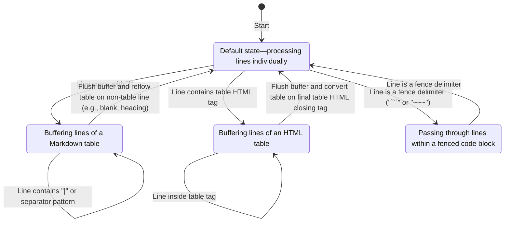

# Markdown stream processor

`process_stream_inner` orchestrates line-by-line rewriting. The full
implementation lives in [src/process.rs](../src/process.rs). Its signature is:

```rust
pub fn process_stream_inner(lines: &[String], opts: Options) -> Vec<String>
```

The function combines several helpers documented in `docs/`:

- `fences::compress_fences` and `attach_orphan_specifiers` normalise code block
  delimiters.
- `html::convert_html_tables` transforms basic HTML tables into Markdown so they
  can be reflowed like regular tables. See
  [HTML table support](html-table-support.md).
- `wrap::wrap_text` applies optional line wrapping. It relies on the
  `unicode-width` crate for accurate character widths.

The function maintains a small state machine that tracks whether it is inside a
Markdown table, an HTML table, or a fenced code block. The state determines how
incoming lines are buffered or emitted. Once the end of a table or fence is
reached, buffered lines are flushed and possibly reformatted. The simplified
behaviour is illustrated below.



Before:

```markdown
|A|B|
|---|---|
|1|22|
<table><tr><td>3</td><td>4</td></tr></table>
```

After:

```markdown
| A | B  |
| --- | --- |
| 1 | 22 |
| 3 | 4  |
```

Code fences are passed through verbatim:

```rust
| not | a | table |
```

After scanning all lines the processor performs optional post-processing steps
such as ellipsis replacement and footnote conversion. See
[footnote conversion](footnote-conversion.md) for details. The function then
returns the updated stream for writing to disk or further manipulation.
