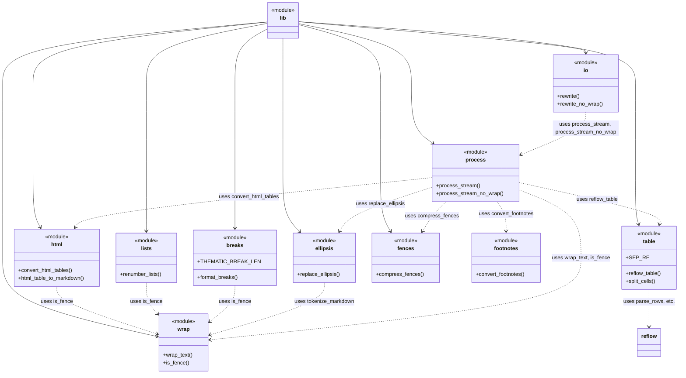

# Module Relationships

This diagram illustrates the connections between the crate's modules.

The `lib` module re-exports the public API from the other modules. The
`ellipsis` module performs text normalisation. The `process` module provides
streaming helpers that combine the lower-level functions, including ellipsis
replacement and footnote conversion. The `io` module handles filesystem
operations, delegating the text processing to `process`.
