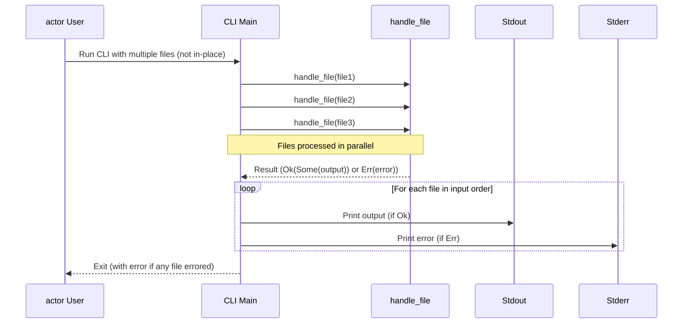

# Concurrency with `rayon`

`mdtablefix` uses the `rayon` crate to process multiple files concurrently.
`rayon` provides a work-stealing thread pool and simple parallel iterators. The
tool relies on Rayon’s global thread pool so that no manual setup is required.
The dependency is specified as `^1.0` in `Cargo.toml` to track stable API
changes within the same major release.

Parallelism is enabled automatically whenever more than one file path is
provided on the command line. Each worker gathers its output before printing so
results appear in the original order. This buffering increases memory usage and
may reduce performance if many tiny files are processed.

